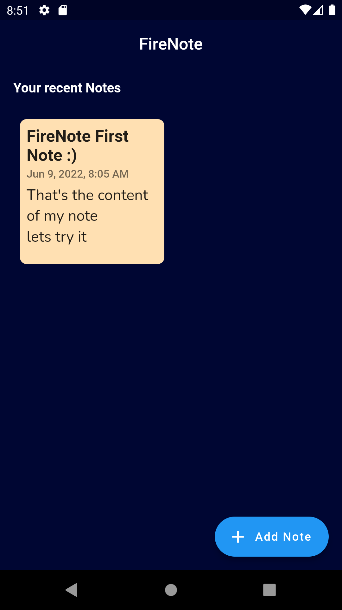
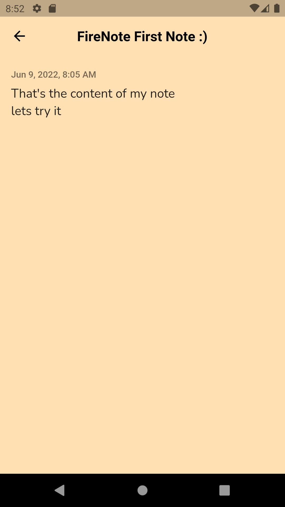
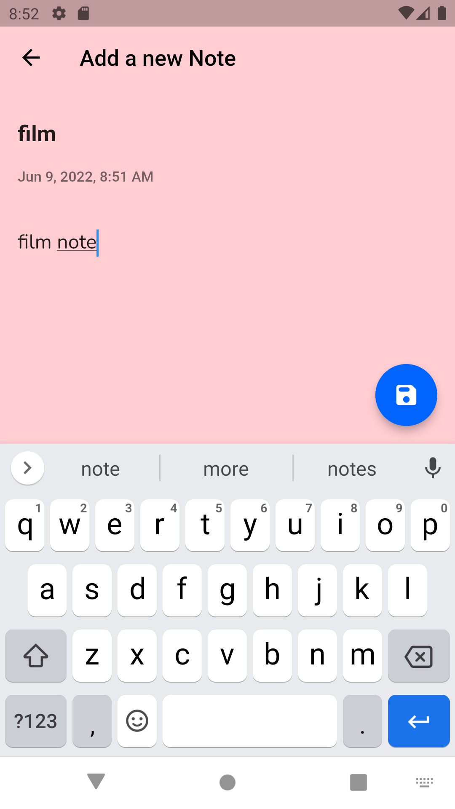
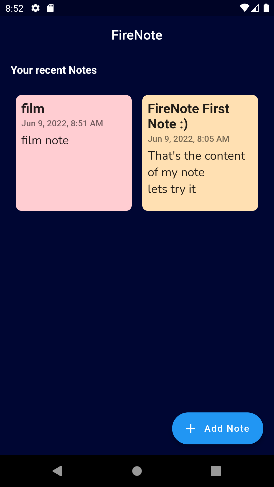
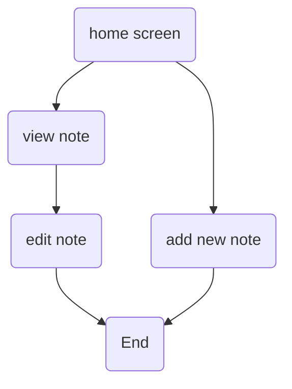

# NoteFire App

It's simple note app that help you to take note over the day with  **firebase** integration to save you note to cloud. 

## Skills

 - Fire Store  
 - CRUD Operations
 - Auth 

## Some Images

|s|s|s|s
|-|-|-|-
||||

 

## UML diagrams
