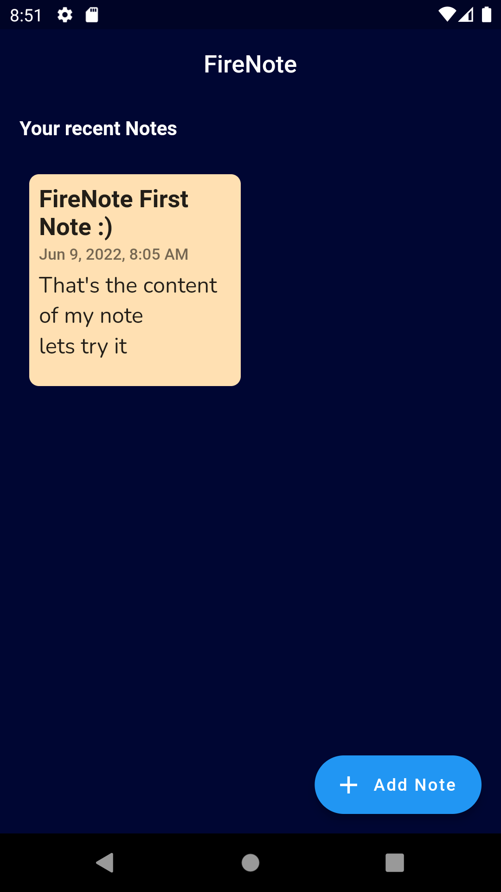
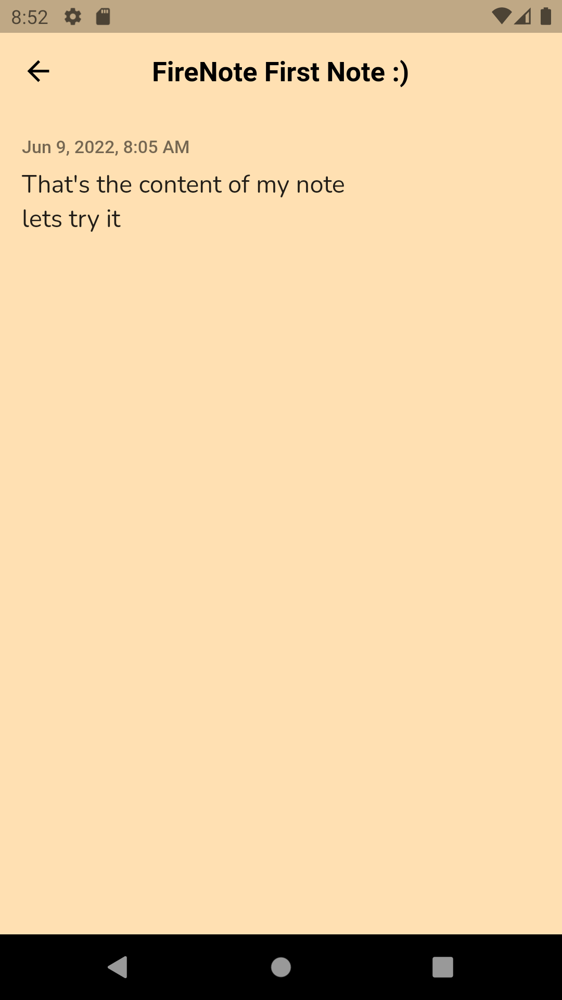
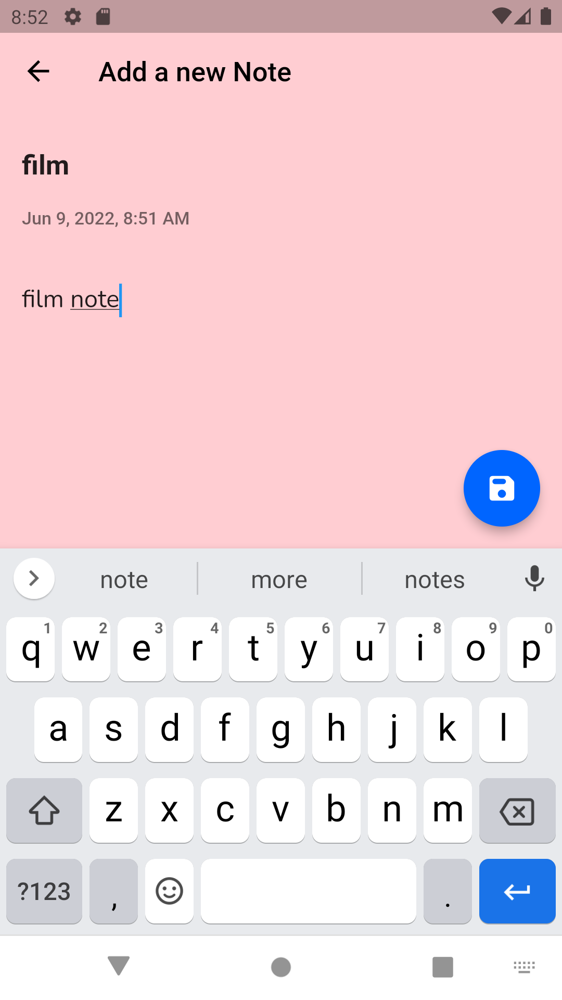
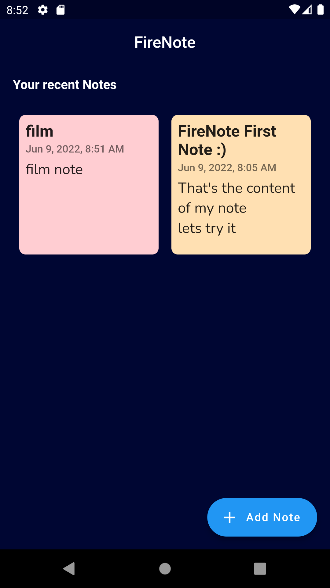
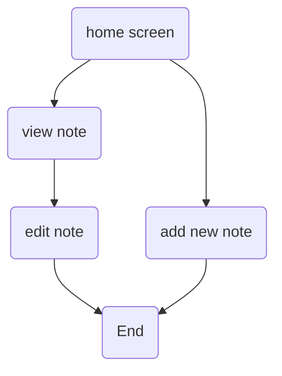

# SimpleNote App

It's simple note app that help you to take note over the day .

## Skills

 - SQFLite  
 - CRUD Operations
 - Porvider 

## Some Images

|s|s|s|s
|-|-|-|-
||||

 

## UML diagrams
